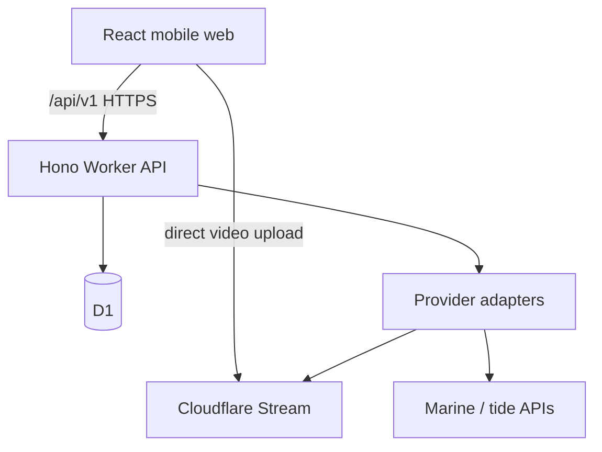
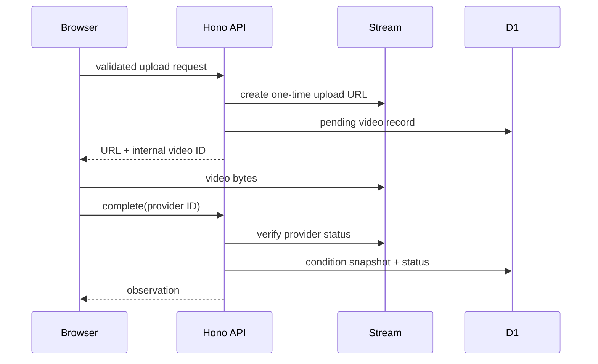

# Architecture

## Boundaries

The frontend owns interaction only. Hono owns auth, authorization, validation, and product policy. Domain modules depend on neither. Vinext compiles the React UI and API into a Cloudflare Worker artifact; the API remains replaceable/splittable because the UI talks only to `/api/v1`.

## Upload flow

The mock adapter skips byte transfer but follows the same request/complete record lifecycle.

## Auth flow

Production uses same-origin LINE Login v2.1 authorization-code/OIDC with one-time state, nonce, PKCE S256, server-side token exchange, LINE's ID-token verification endpoint, and a secure HTTP-only cookie containing only a random opaque session token. D1 stores only an HMAC of that token and its expiry. OAuth attempts are one-time D1 records and expire after ten minutes; app sessions expire after seven days. Development has a fake user only when both development environment and explicit dev auth are enabled. Production fails closed.

## Condition acquisition and matching

Adapters normalize provider payloads to `MarineConditions`. A video stores the exact snapshot and provenance used at capture time. Future matching first filters to the same spot, then calls the deterministic weighted ranking module and returns score plus component differences.

## Why

Serverless components avoid always-on cost. A modular monolith minimizes deployment/auth/CORS work while interface boundaries retain later replaceability. Stream avoids operating an FFmpeg service. See `docs/adr/`.
