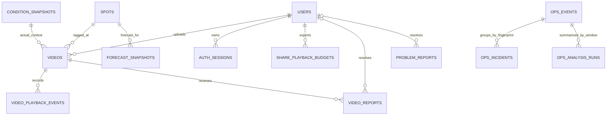

# Data model

`users.line_display_name` is the latest LINE-provided display name and remains a private suggestion. It is distinct from the user-confirmed public name in `users.display_id`; public queries never select the LINE subject or LINE display-name suggestion.

Internal testing is capped at 100 `users` rows. Existing LINE subjects remain eligible at capacity; registration uses a conditional insert against the current row count so a rejected user creates no row or session. This is an application policy and requires no additional public identity field.

New uploads require `videos.spot_id`; the column remains nullable only for legacy/schema compatibility and cannot be filled or changed through the current API. `captured_at` may be null during the seven-day private pending period. `metadata_status`, `metadata_expires_at`, and `public_at` make the lifecycle explicit. `terms_version` prevents silently applying CC0 to older uploads. `moderation_status`/`delisted_at` stop a delisted row from being republished by ordinary metadata changes. `is_favorite` is owner-private; `uploader_note`, `fun_reaction`, and the chosen public name may be public only after completion.

`video_reports` stores a public report reason and its open/resolved lifecycle. A configured administrator can resolve all open reports for one video and delist it in one D1 batch; a report alone never automatically hides media.

`problem_reports` is separate from media moderation. It stores only a 5–300 character problem description, the submitting UI view, open/resolved timestamps, and the resolving administrator's internal ID. It intentionally stores no reporter user ID, LINE data, contact detail, or network address.

`auth_sessions` stores only a session hash and owner reference; one-time `oauth_attempts` store hashed state, nonce, PKCE verifier, and expiry without a user relation. `video_playback_events` stores a random one-use event ID, video reference, and server time. `share_playback_budgets` stores one counter per exporter and Taipei creation month; individual share links are encrypted tokens and have no rows.

`condition_snapshots` describes capture-time context when a provider is available. Missing context is valid and never blocks a completed video.

`forecast_snapshots` stores immutable provider/model/run/valid/lead/grid rows plus `snapshot_kind` (`forecast` or `historical_forecast`). Total wave, total swell, primary/secondary/tertiary swell, wind wave, their available peak periods, tide, wind, and gust fields are nullable because a provider may omit components. Explicit total-swell columns prevent DWD GWAM's aggregate swell from being mislabeled as a primary partition. A unique source key prevents duplicate ingestion while never averaging models.

Videos do not copy every provider row or retain multiple timeseries. Owner and matching reads select one nearby row per video/provider/model: prefer `historical_forecast`, otherwise use a `forecast` issued by capture time. The underlying immutable archive is shared across videos. Open-Meteo collect-only models retain only one future plus six recent-past hours per scheduled run; only active MFWAM retains the 168-hour future horizon.

`ops_events` stores only curated operational event codes, severity, source, bounded route/error metadata, optional request ID, a sanitized summary, and timestamps. It never stores request bodies, cookies, authorization headers, provider credentials, raw client addresses, LINE subjects, or raw Cloudflare log payloads. `ops_incidents` deduplicates actionable fingerprints and records notification/recovery lifecycle. `ops_analysis_runs` stores one bounded structured result per hourly UTC window. Event retention is seven days and analysis retention is thirty days; raw Workers Logs remain the evidence source rather than being copied into D1.

All instants are UTC ISO strings. Product validation compares exact elapsed time; display uses `Asia/Taipei`.
