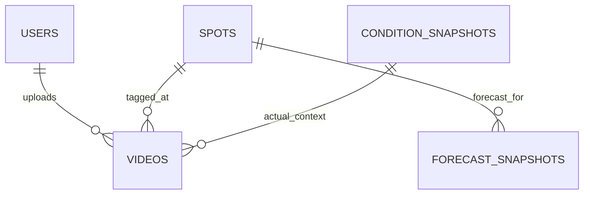

# Data model

`videos.spot_id` and `captured_at` are nullable during the seven-day private pending period. `metadata_status`, `metadata_expires_at`, and `public_at` make the lifecycle explicit. `terms_version` prevents silently applying CC0 to older uploads. `moderation_status`/`delisted_at` stop a delisted row from being republished by ordinary metadata changes. `is_favorite` is owner-private; `uploader_note`, `fun_reaction`, and the chosen public ID may be public only after completion.

`video_reports` stores a public report reason and its open/resolved lifecycle. A configured administrator can resolve all open reports for one video and delist it in one D1 batch; a report alone never automatically hides media.

`condition_snapshots` describes capture-time context when a provider is available. Missing context is valid and never blocks a completed video.

`forecast_snapshots` stores immutable provider/model/run/valid/lead/grid rows. Total wave, primary/secondary swell, wind wave, tide, wind, and gust fields are nullable because a provider may omit components. A unique source key prevents duplicate ingestion while never averaging models.

All instants are UTC ISO strings. Product validation compares exact elapsed time; display uses `Asia/Taipei`.
