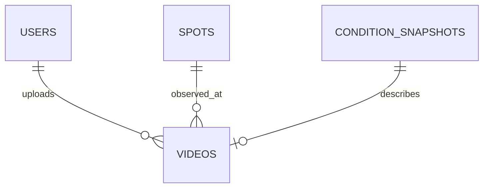

# Data model

## Relationships

`users` stores internal ID, private unique LINE subject, optional public `display_id`, and default visibility. Public APIs never select the LINE subject.

`spots` stores the versioned checklist and independently sourced geographic provenance. Coordinates/translations are nullable.

`videos` stores provider identity, ownership, spot, UTC capture/upload times, duration, processing status, public-identity choice, and snapshot reference.

`condition_snapshots` uses nullable typed columns for searchable metrics plus provider/model/run/valid/retrieval/schema provenance. Optional raw payload is debugging-only.

Important indexes cover LINE subject, spot slug, video spot + capture time, snapshot reference, and provider video identity. `db/schema.ts` is authoritative; generated SQL is in `drizzle/`.

All stored instants are UTC ISO strings. Only product-date decisions convert explicitly to `Asia/Taipei`.

Lifecycle: request creates `awaiting_upload`; completion verifies the provider and changes to `pending`, `processing`, `ready`, or `error`. Deletion/retention policy is unresolved and must be decided before public launch.
